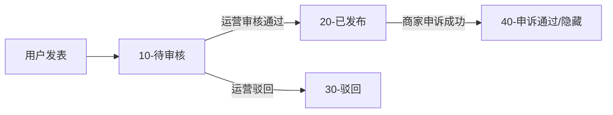
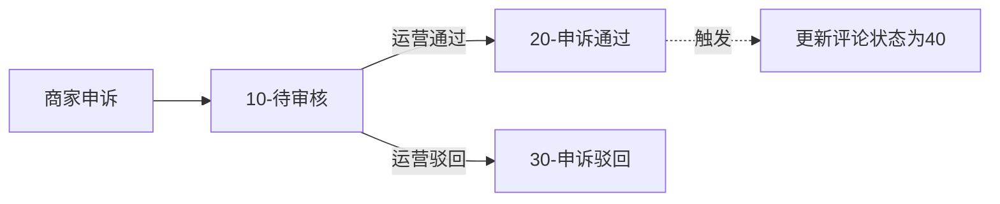

# Review Service (电商评论服务)

基于 Kratos 框架开发的微服务电商评论系统。该服务负责管理用户评论的完整生命周期，包括评论发布、运营审核、商家回复以及商家申诉处理。系统采用读写分离架构，结合 Redis 缓存和 Elasticsearch 搜索，以支持高性能的查询需求。

## 📚 项目概述

review 服务是电商平台的核心组件之一，旨在连接用户、商家和运营人员：
*   **用户 (C端)**：对购买的商品和服务进行评价（评分、图文/视频），并支持追加评论。
*   **商家 (B端)**：查看店铺评价，回复用户评论，对恶意差评发起申诉。
*   **运营 (O端)**：后台审核用户发布的评论，处理商家的申诉请求，维护平台内容质量。

## 🛠 技术栈

### 核心框架与语言
*   **Golang**: `1.23+`
*   **Framework**: [Kratos v2](https://github.com/go-kratos/kratos) - Bilibili 开源的微服务框架
*   **API Protocol**: gRPC (内部通信) & HTTP (网关暴露)
*   **Serialization**: Protocol Buffers

### 数据存储与中间件
*   **MySQL**: 核心业务数据存储 (Review, Reply, Appeal)。
*   **Elasticsearch**: 搜索引擎，用于高性能的复杂查询（商家/用户维度的评论列表）。
*   **Redis**: 缓存层，加速热点数据读取。

### 核心库与工具
*   **ORM**: [GORM](https://gorm.io/) + [GORM Gen](https://gorm.io/gen) (类型安全的 SQL 构建)。
*   **Dependency Injection**: [Google Wire](https://github.com/google/wire) (编译期依赖注入)。
*   **Service Discovery**: [Consul](https://www.consul.io/) (服务注册与发现)。
*   **Concurrency Control**: `golang.org/x/sync/singleflight` (防止缓存击穿)。
*   **ID Generator**: Snowflake (雪花算法生成分布式 ID)。
*   **Validation**: `protoc-gen-validate` (参数校验)。

## ✨ 功能特性

### 1. 评论管理 (User Side)
*   **发布评论**: 支持评分（商品/服务/快递）、文本内容、上传图片/视频。
*   **追加评论**: 对同一订单支持追加评论内容。
*   **查询评论**: 分页获取用户个人的历史评论。

### 2. 商家互动 (Merchant Side)
*   **评论列表**: 高性能查询店铺下的所有评论（基于 ES）。
*   **回复评论**: 商家可以对用户评论进行回复（每条评论限回复一次）。
*   **申诉机制**: 针对不实或恶意评论发起申诉，填写申诉理由及举证材料。

### 3. 运营审核 (Operation Side)
*   **评论审核**: 审核用户新发布的评论（发布 -> 待审核 -> 已发布/驳回）。
*   **申诉审核**: 审核商家的申诉请求。若申诉通过，相关评论将自动隐藏或标记。

### 4. 高级特性
*   **读写分离**: 写入操作直接落库 MySQL；读取操作优先查 Redis，未命中查 ES。
*   **防缓存击穿**: 使用 Singleflight 合并并发请求，保护后端存储。
*   **状态机管理**: 严格的评论与申诉状态流转逻辑。

## 🏗 系统架构

### 目录结构
遵循 Kratos 标准布局 (Layout)：

```
review/
├── api/             # Protocol Buffers 定义 (gRPC/HTTP 接口)
│   ├── business/    # B端接口
│   ├── operation/   # 运营端接口
│   └── review/      # 核心评论接口
├── cmd/             # 程序入口 (main.go, wire依赖注入)
├── configs/         # 配置文件 (config.yaml, registry.yaml)
├── internal/
│   ├── biz/         # 业务逻辑层 (UseCase, Domain Object)
│   ├── data/        # 数据访问层 (Repository, MySQL/ES/Redis 实现)
│   ├── service/     # 接口实现层 (DTO 转换, 调用 biz)
│   ├── server/      # HTTP/gRPC Server 配置
│   └── conf/        # 配置结构体定义 (.proto)
├── pkg/             # 公共包 (snowflake 等)
└── third_party/     # 第三方 proto 文件
```

### 状态流转图

**评论生命周期:**


**申诉生命周期:**


## 🚀 快速开始

### 前置要求
*   Go 1.23+
*   Docker & Docker Compose
*   Consul (服务发现)
*   MySQL, Redis, Elasticsearch

### 本地运行

1.  **启动依赖环境**
    使用根目录或项目目录下的 `docker-compose.yaml` 启动基础设施：
    ```bash
    docker-compose up -d
    ```

2.  **初始化数据库**
    执行 review.sql 脚本初始化 MySQL 表结构。

3.  **生成代码** (如有修改 proto 或 wire)
    ```bash
    make api   # 生成 proto 代码
    make wire  # 生成依赖注入代码
    ```

4.  **运行服务**
    ```bash
    # 下载依赖
    go mod tidy
    
    # 运行
    kratos run
    ```

### 配置文件
修改 config.yaml 以匹配你的本地环境：
```yaml
data:
  database:
    driver: mysql
    source: root:password@tcp(127.0.0.1:3306)/reviewdb...
  redis:
    addr: 127.0.0.1:6379
  elasticsearch:
    addresses: ["http://127.0.0.1:9200"]
```

## 📝 API 概览

| Method | URI | Description |
| :--- | :--- | :--- |
| `POST` | `/v1/review` | 创建评论 (用户) |
| `GET` | `/v1/review/{reviewID}` | 获取评论详情 |
| `POST` | `/v1/review/reply` | 回复评论 (商家) |
| `POST` | `/v1/review/appeal` | 申诉评论 (商家) |
| `POST` | `/v1/review/audit` | 审核评论 (运营) |
| `POST` | `/v1/appeal/audit` | 审核申诉 (运营) |
| `GET` | `/v1/review/store/{storeID}` | 获取店铺评论列表 (ES搜索) |
| `GET` | `/v1/review/user/{userID}` | 获取用户评论列表 (ES搜索) |
